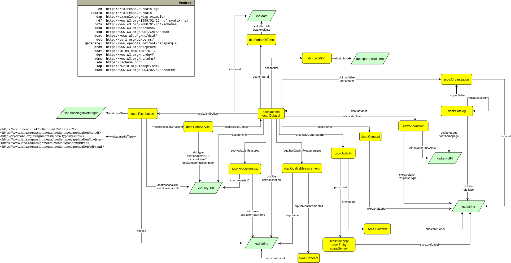

FAIR-EASE DCAT-AP is a DCAT application profile that specifies how datasets should be described within the FAIR-EASE framework, ensuring consistency and interoperability.

## DCAT-AP Diagram

The included classes and properties are visualized in the diagram below:

can be used to validate the conformance of a dataset description to the FE-DCAT-AP.

## Validation

To verify that a dataset description conforms to the FE-DCAT-AP standard, you can use the following SHACL shapes file:

[FE-DCAT-AP-SHACLshapes.ttl](FE-DCAT-AP-SHACLshapes.ttl) 